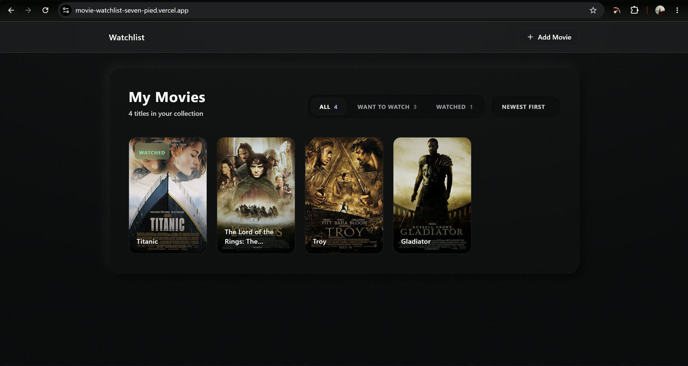
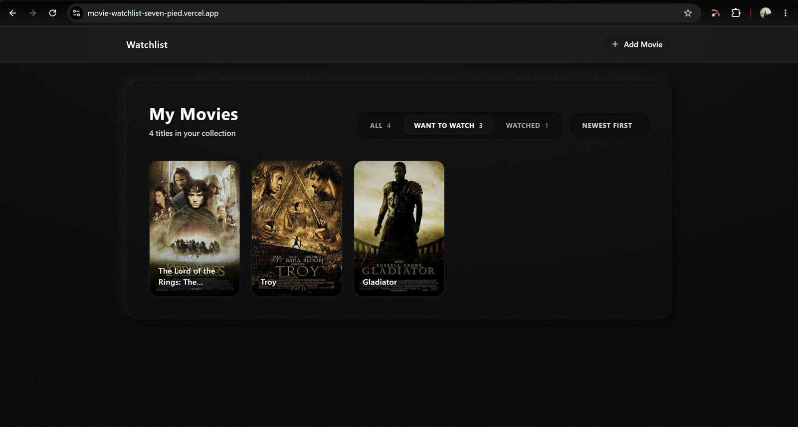
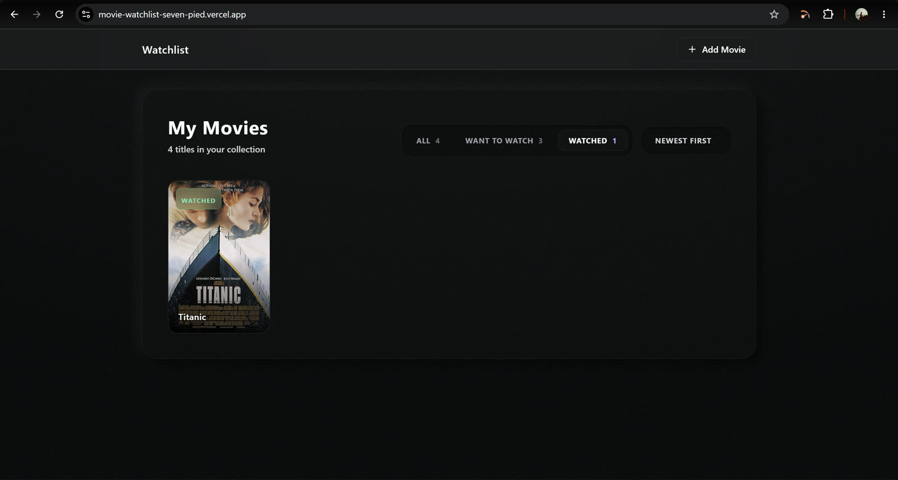
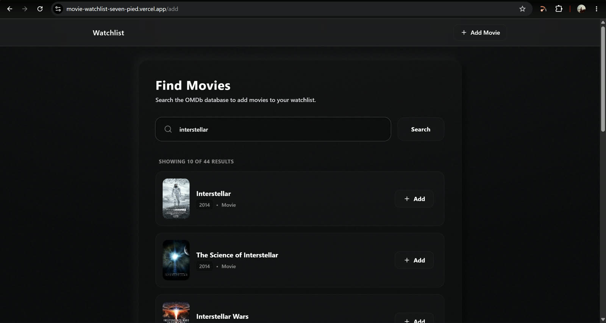

# Movie Watchlist

A dark-themed full-stack movie watchlist built with Next.js, TypeScript, MongoDB, Mongoose, Tailwind CSS, and the OMDb API.

Search for movies, add them to your collection, separate movies into **Want to Watch** and **Watched**, and manage your personal ratings and notes from the movie detail page.

## Live Demo

[Open Movie Watchlist](https://movie-watchlist-seven-pied.vercel.app/)

## Features

- Search the OMDb database by movie title.
- Add movies to a MongoDB-backed watchlist.
- View posters, titles, years, status badges, and ratings in a responsive collection grid.
- Filter the collection by **All**, **Want to Watch**, or **Watched**.
- Sort movies by newest, rating, or title.
- Open a movie detail page with plot, cast, year, IMDb rating, personal status, rating, and notes.
- Update or remove saved movies through the built-in REST API.
- Responsive dark interface with empty, loading, and error states.

## Screenshots

### Complete watchlist



### Want to Watch filter



### Watched filter



### Search and add movies



## Tech Stack

- [Next.js 15](https://nextjs.org/) with the App Router and Route Handlers
- [TypeScript](https://www.typescriptlang.org/)
- [MongoDB](https://www.mongodb.com/) with [Mongoose](https://mongoosejs.com/)
- [Tailwind CSS](https://tailwindcss.com/)
- [OMDb API](https://www.omdbapi.com/)
- [Lucide React](https://lucide.dev/)

## Prerequisites

- Node.js 18 or later
- A MongoDB database, either local or hosted through MongoDB Atlas
- An OMDb API key from [omdbapi.com](https://www.omdbapi.com/apikey.aspx)

## Local Setup

1. Clone the repository and install dependencies:

   ```bash
   git clone https://github.com/naren214/Movie_Watchlist.git
   cd Movie_Watchlist
   npm install
   ```

2. Create a local environment file:

   ```bash
   cp .env.local.example .env.local
   ```

3. Add your credentials to `.env.local`:

   ```env
   MONGODB_URI=mongodb://localhost:27017/movie-watchlist
   NEXT_PUBLIC_OMDB_API_KEY=your_omdb_api_key_here
   ```

   | Variable | Description |
   |---|---|
   | `MONGODB_URI` | MongoDB connection string for a local database or MongoDB Atlas. |
   | `NEXT_PUBLIC_OMDB_API_KEY` | API key used to search the OMDb movie database. |

4. Start the development server:

   ```bash
   npm run dev
   ```

5. Open [http://localhost:3000](http://localhost:3000).

## Available Scripts

| Command | Description |
|---|---|
| `npm run dev` | Start the development server. |
| `npm run build` | Create a production build. |
| `npm run start` | Start the production server. |

## API Reference

| Method | Endpoint | Description |
|---|---|---|
| `GET` | `/api/watchlist` | Return all saved movies. |
| `POST` | `/api/watchlist` | Add a movie using its OMDb details. |
| `PATCH` | `/api/watchlist/:id` | Update status, personal rating, or notes. |
| `DELETE` | `/api/watchlist/:id` | Remove a movie from the watchlist. |

## Project Structure

```text
src/
├── app/
│   ├── layout.tsx                 # Shared navigation and page layout
│   ├── page.tsx                   # Watchlist grid, filters, and sorting
│   ├── globals.css                # Global dark-theme styles
│   ├── add/page.tsx               # OMDb search and add flow
│   ├── movie/[id]/page.tsx        # Movie details and personal metadata
│   └── api/watchlist/
│       ├── route.ts               # GET and POST handlers
│       └── [id]/route.ts          # PATCH and DELETE handlers
└── lib/
    ├── mongodb.ts                 # Cached Mongoose connection
    ├── types.ts                   # Shared TypeScript types
    └── models/WatchlistMovie.ts   # MongoDB schema and model
```

## Deployment

The app can be deployed to [Vercel](https://vercel.com/). Configure these environment variables in the Vercel project settings before deploying:

```text
MONGODB_URI
NEXT_PUBLIC_OMDB_API_KEY
```

For MongoDB Atlas, make sure the deployed application's connection is allowed by the Atlas network access settings.

## License

This project is for educational and portfolio purposes.
